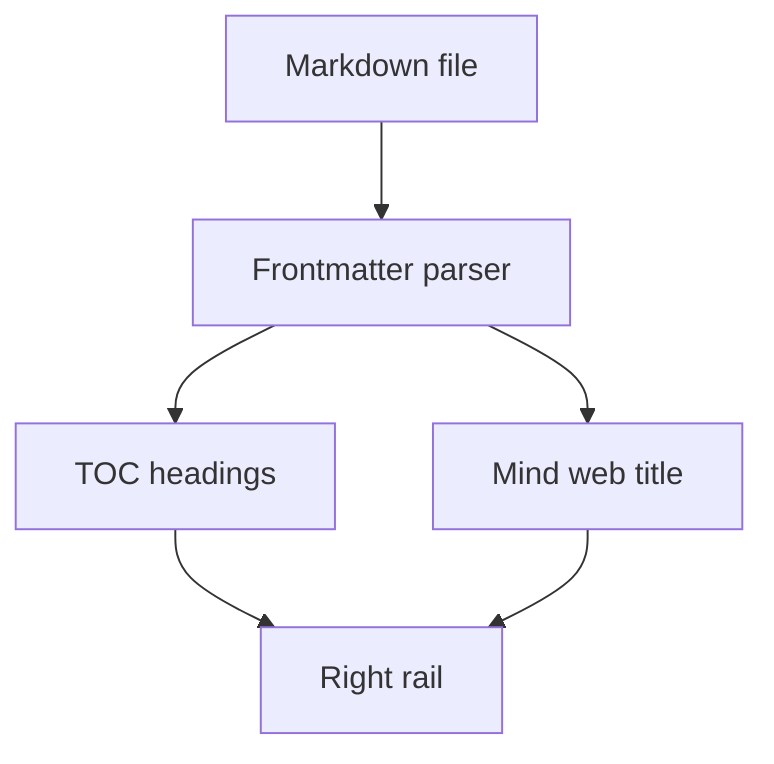

## What you get

This template reads markdown files from `content/blog/**.md` and automatically wires:

- route path from folder/file name
- right TOC progress rail from `##` / `###` headings
- mind web node title from frontmatter `title`

## Folder routing

File:

```txt
content/blog/getting-started/about-template.md
```

Route:

```txt
/getting-started/about-template
```

## Frontmatter fields

Use this frontmatter schema:

```yaml
---
title: "Post title"
description: "One-line summary"
author: "Your name"
inspiredBy: "Source or reference"
date: "2026-07-24"
readingTime: "6 min" # optional, auto-calculated if omitted
isNew: true          # optional
---
```

## Rich markdown

Image:


Video:

<video controls src="/vengeance-demo.mp4"></video>

### Mermaid diagram


